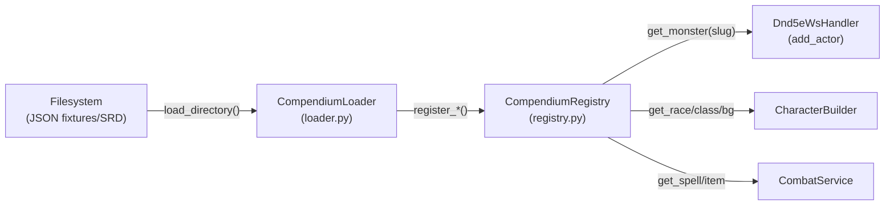
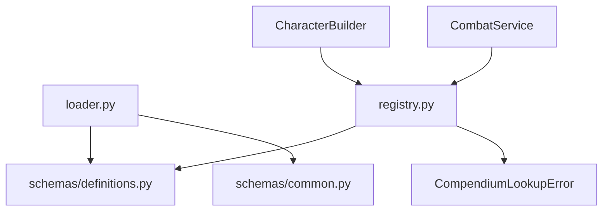

# Module 03 — Data & Compendium

> **As-Is Documentation** | Files: `systems/dnd5e/data/loader.py`, `systems/dnd5e/data/registry.py`

## Overview

The `data` module acts as the read-only game data layer. It parses external JSON files (sourced from the Open5e SRD) into strongly-typed Pydantic `Definition` models, and stores them in the `CompendiumRegistry` at application startup for fast O(1) slug-based lookup.

---

## Component Diagram



---

## `CompendiumLoader`

**Purpose:** Reads JSON files and translates them into validated Pydantic models.

```python
class CompendiumLoader:
    def load_monster_file(self, path) -> MonsterDefinition
    def load_spell_file(self, path) -> SpellDefinition
    def load_item_file(self, path) -> ItemDefinition
    def load_directory(self, base_path, entity_type="monsters") -> int
```

### Key Normalization Behaviors

| JSON Input Issue | Normalization Applied |
|---|---|
| Challenge Rating as string (`"1/4"`) | Converted to float (`0.25`) |
| Loose speed strings | Parsed into `SpeedBlock` sub-model |
| Nested action data | Assembled into `ActionDefinition` objects |
| Missing optional fields | Defaulted per Pydantic model configs |

### Entity Types Supported
- `monsters` → `MonsterDefinition`
- `spells` → `SpellDefinition`
- `items` → `ItemDefinition`
- `races` → `RaceDefinition` (for CharacterBuilder)
- `classes` → `ClassDefinition`
- `backgrounds` → `BackgroundDefinition`

---

## `CompendiumRegistry`

**Purpose:** Thread-safe in-memory lookup table for all definition types, indexed by unique slug strings.

```python
class CompendiumRegistry:
    def register_monster(self, definition: MonsterDefinition) -> None
    def get_monster(self, slug: str) -> Optional[MonsterDefinition]

    def register_spell(self, definition: SpellDefinition) -> None
    def get_spell(self, slug: str) -> Optional[SpellDefinition]

    # Same pattern for items, races, classes, backgrounds...

    def count(self, entity_type: str) -> int
    def list_all(self, entity_type: str) -> list
```

### Lookup Key Format
All entries are indexed by a lowercase, hyphenated **slug**. Examples:
- `"adult-red-dragon"` → `MonsterDefinition`
- `"fireball"` → `SpellDefinition`
- `"half-orc"` → `RaceDefinition`
- `"barbarian"` → `ClassDefinition`

### Error Handling

```python
class CompendiumLookupError(Exception):
    """Raised when a required definition is not found in the registry."""
```

Used by `CharacterBuilder.build()` to fail fast if a blueprint references an invalid slug.

---

## Usage — Startup Bootstrap

```python
# main.py lifespan
if settings.LOAD_MOCK_DATA:
    loader = DataLoader(str(fixtures_dir))
    async with AsyncSessionLocal() as session:
        await loader.load_all(session)
```

The `DataLoader` orchestrates loading all entity types in a single pass at application start. In production, this populates from full SRD data. In test/dev, it loads from the `data/fixtures/` directory.

---

## Dependencies


