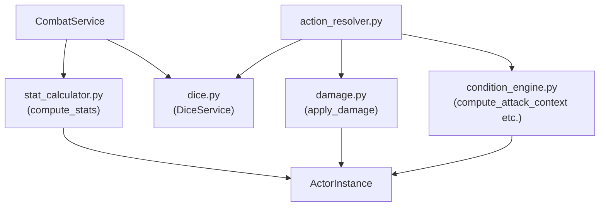
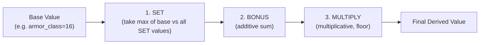
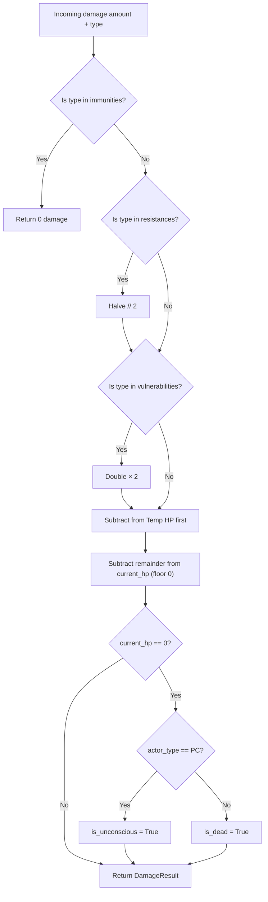

# Module 04 — Stateless Rules Engine

> **As-Is Documentation** | Files: `engine/dice.py`, `engine/stat_calculator.py`, `engine/damage.py`, `engine/condition_engine.py`

## Overview

The stateless rules engine is a set of **pure functions and stateless classes** that implement all core D&D 5e mechanics math. These functions never mutate state — they receive immutable parameters and return result models. The Action Resolver and ws_handler compose these primitives.

---

## Composition Diagram



---

## `DiceService` (`dice.py`)

Parses standard dice notation strings and produces `DiceRoll` results.

### `DiceRoll` Result Model

```python
class DiceRoll(BaseModel):
    individual_rolls: List[int]  # Raw values of each die
    modifier: int = 0
    total: int                   # sum(individual_rolls) + modifier
    roll_count: int = 1
    roll_used: Optional[int]     # For adv/disadv: the selected roll
```

### Methods

| Method | Signature | Description |
|---|---|---|
| `DiceService.roll(expression, seed?)` | `"2d10+8"` → `DiceRoll` | Parse and roll any standard notation |
| `DiceService.roll_d20(advantage, disadvantage, modifier, overrides, seed)` | → `DiceRoll` | PHB-accurate d20 roll; advantage/disadvantage cancel when both applied |

### Dice Expression Format
Valid regex: `^\d+d\d+([+-]\d+)?$`

Examples: `1d20`, `2d10+8`, `4d6-1`

### Advantage / Disadvantage Rules
- If **both** are applied: they cancel; a single d20 is rolled
- **Advantage**: roll 2d20, take higher
- **Disadvantage**: roll 2d20, take lower
- `roll_used` field always contains the selected value

### Determinism
Pass `seed=<int>` for reproducible results in tests.

---

## `stat_calculator.py`

Pure functions for computing derived stats from an `ActorInstance`.

### Core Functions

```python
def calculate_modifier(score: int) -> int:
    """PHB: floor((score - 10) / 2)"""

def calculate_proficiency_bonus(level: int) -> int:
    """Level 1-4→+2, 5-8→+3, 9-12→+4, 13-16→+5, 17-20→+6"""

def compute_stats(actor: ActorInstance) -> ComputedStats:
    """Apply all effects to derive final AC and Speed."""

def compute_spell_save_dc(actor: ActorInstance, ability: Ability) -> int:
    """PHB: 8 + proficiency_bonus + ability_modifier"""
```

### Effect Stacking Order



### `ComputedStats` Result Model

```python
class ComputedStats(BaseModel):
    armor_class: int = 10
    speed: SpeedBlock
    attack_bonus: int = 0
    save_bonuses: dict[str, int] = {}
```

> [!NOTE]
> `compute_stats()` does NOT apply condition effects (e.g., speed=0 from Grappled). Use `condition_engine.apply_conditions()` for condition-driven speed changes.

---

## `damage.py` — Damage Pipeline

Single pure function `apply_damage()` resolves a complete PHB damage cascade.

### `DamageResult` Result Model

```python
class DamageResult(BaseModel):
    damage_dealt: int             # After immunity/resistance/vuln
    damage_absorbed_by_temp: int  # Temp HP consumed
    remaining_hp: int
    remaining_temp_hp: int
    is_dead: bool
    is_unconscious: bool          # True only for PCs reaching 0 HP
```

### Pipeline (in order)



> [!IMPORTANT]
> Immunities, resistances, and vulnerabilities are passed **explicitly** to `apply_damage()`. The caller (action_resolver or ws_handler) is responsible for reading them from the MonsterDefinition's SRD string lists before calling.

---

## `condition_engine.py` — Condition Mechanics

Computes mechanical impact of all 15 PHB conditions + exhaustion levels 1–6.

### Result Models

```python
class ConditionComputedStats(BaseModel):
    speed: SpeedBlock
    max_hp: int               # Halved at exhaustion level 4
    ability_check_disadvantage: bool

class AttackContext(BaseModel):
    has_advantage: bool
    has_disadvantage: bool

class SaveContext(BaseModel):
    auto_fail: bool           # True for STR/DEX saves vs Paralyzed etc.
    has_advantage: bool
    has_disadvantage: bool
```

### Key Functions

```python
def apply_conditions(actor) -> ConditionComputedStats
def compute_attack_context(actor) -> AttackContext
def compute_save_context(actor, ability) -> SaveContext
```

### Condition → Mechanical Effect Reference

| Condition | Effect |
|---|---|
| `Blinded` | Attack: Disadvantage |
| `Frightened` | Attack: Disadvantage (can't move toward source) |
| `Poisoned` | Attack: Disadvantage |
| `Prone` | Attack: Disadvantage; melee attacks against: Advantage |
| `Restrained` | Attack: Disadvantage; DEX saves: Disadvantage; Speed 0 |
| `Invisible` | Attack: Advantage |
| `Grappled` | Speed 0 |
| `Paralyzed` | Speed 0; STR/DEX saves: Auto-fail; Attacks against: Advantage |
| `Petrified` | Speed 0; STR/DEX saves: Auto-fail |
| `Stunned` | Speed 0; STR/DEX saves: Auto-fail |
| `Unconscious` | Speed 0; STR/DEX saves: Auto-fail; melee attacks: Auto-crit |

### Exhaustion Levels

| Level | Effect |
|---|---|
| 1 | Disadvantage on ability checks |
| 2 | Speed halved |
| 3 | Disadvantage on attack rolls and saving throws |
| 4 | Max HP halved |
| 5 | Speed reduced to 0 |
| 6 | Death |

---

## Dependencies

All four modules require only `schemas/` (instances and enums). They have **no** dependencies on services, databases, or each other (except `action_resolver.py` which composes all of them).
