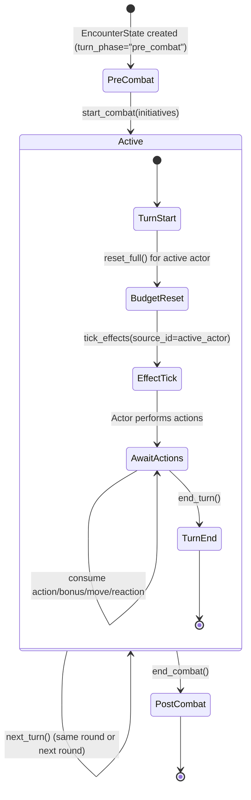
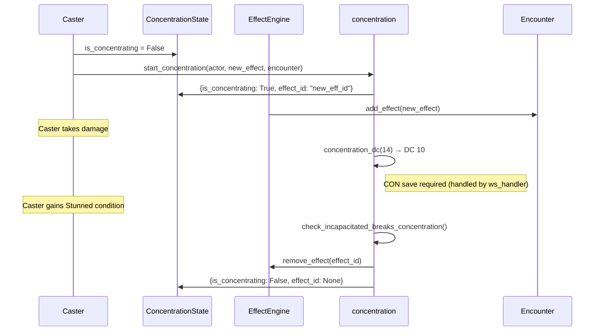
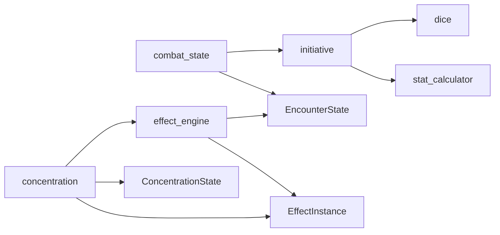

# Module 05 — Combat State Machine

> **As-Is Documentation** | Files: `engine/initiative.py`, `engine/combat_state.py`, `engine/effect_engine.py`, `engine/concentration.py`

## Overview

The combat state machine manages the temporal lifecycle of an encounter: initiative order, turn advancement, resource budget management, effect duration ticking, and concentration tracking. These modules mutate `EncounterState` in-place.

---

## State Machine Lifecycle



---

## `initiative.py`

Pure functions for rolling and sorting initiative.

### `InitiativeEntry`

```python
class InitiativeEntry(BaseModel):
    actor_id: str
    roll: int        # d20 + DEX modifier
    dex_score: int   # Raw DEX score for tie-breaking
```

### Functions

```python
def roll_initiative(actor, seed=None) -> InitiativeEntry:
    """Roll d20 + DEX modifier."""

def sort_combatants(entries) -> List[InitiativeEntry]:
    """Sort descending by roll, then by dex_score on tie."""
```

**Tie-breaking rule:** Higher raw DEX score wins. Fully deterministic.

---

## `combat_state.py`

Manages turn sequencing and `TurnBudget` allocation.

### `TurnBudget`

```python
class TurnBudget(BaseModel):
    action_available: bool = True
    bonus_action_available: bool = True
    reaction_available: bool = True
    movement_remaining: int = 30

    def use_action(self) -> None
    def use_bonus_action(self) -> None
    def use_reaction(self) -> None
    def use_movement(self, amount: int) -> None
    def reset_full(self) -> None
    def reset_reaction(self) -> None
```

> [!WARNING]
> `TurnBudget` objects are stored in a **module-level in-memory dictionary** keyed by `encounter_id:actor_id`. This is an MVP pattern and is not persisted to the database.

### Lifecycle Functions

```python
def start_combat(encounter, initiatives) -> None:
    """Sort combatants, set round=1, initialize all TurnBudgets."""

def next_turn(encounter) -> None:
    """Advance active_index, wrapping to next round. Reset budget for new actor."""

def get_active_combatant(encounter) -> Optional[ActorInstance]:
    """Return the combatant at encounter.active_index."""

def get_turn_budget(encounter, actor_id) -> TurnBudget:
    """Get or create the budget for a specific actor."""
```

### Turn Advancement Flowchart

```mermaid
flowchart TD
    A["next_turn(encounter)"] --> B["active_index += 1"]
    B --> C{active_index >= len(combatants)?}
    C -- Yes --> D["active_index = 0\nround_number += 1"]
    C -- No --> E["_on_turn_start()"]
    D --> E
    E --> F["get_active_combatant()"]
    F --> G["budget.reset_full()"]
```

### PHB Rules Enforced
- **Reaction** resets at the **start of YOUR own turn** (not end of another)
- **Movement** always resets to 30ft (hardcoded MVP — does not read actor speed)
- On `start_combat`, the first active actor immediately gets their budget reset

---

## `effect_engine.py`

Manages the lifecycle of `EffectInstance` objects on actors and the global encounter.

### Functions

```python
def add_effect(encounter, effect: EffectInstance) -> None:
    """Append effect to the target actor identified by effect.target_id."""

def remove_effect(encounter, effect_id: str) -> None:
    """Remove effect from any actor. Also removes linked conditions via source_effect_id."""

def has_effect(actor, effect_id: str) -> bool

def tick_effects(encounter, *, source_id: str) -> dict:
    """Decrement remaining_rounds for effects created by source_id.
    Automatically removes effects at 0. Returns ticked/expired lists."""
```

### Effect Tick Return Format

```json
{
  "ticked": [
    { "effect_instance_id": "...", "effect_id": "...", "target_actor_id": "...", "remaining_duration": 2 }
  ],
  "expired": [
    { "effect_instance_id": "...", "effect_id": "...", "target_actor_id": "...", "remaining_duration": 0 }
  ]
}
```

### Effect Removal Cascade
When an effect is removed (manually or by expiry), all `ConditionInstance` objects on all actors whose `source_effect_id` matches are **also removed**. This implements the "condition ends when the effect ends" PHB rule.

---

## `concentration.py`

Handles the full PHB concentration lifecycle.

### Core Functions

```python
def concentration_dc(damage: int) -> int:
    """PHB: max(10, floor(damage / 2))"""

def break_concentration(actor, encounter) -> None:
    """Remove effect linked to actor.concentration.effect_id, reset ConcentrationState."""

def start_concentration(actor, effect, encounter) -> None:
    """If already concentrating, break previous first. Apply new effect. Update ConcentrationState."""

def check_incapacitated_breaks_concentration(actor, encounter) -> None:
    """If actor has an incapacitating condition, auto-break concentration."""
```

### Incapacitating Conditions (auto-break)
`Incapacitated`, `Paralyzed`, `Petrified`, `Stunned`, `Unconscious`

### Concentration State Flow



---

## Dependencies


