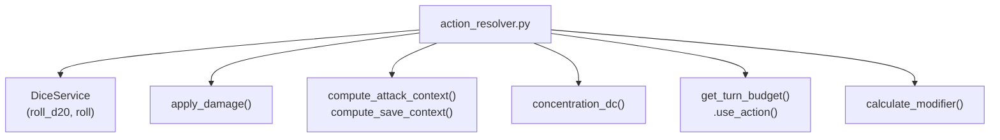
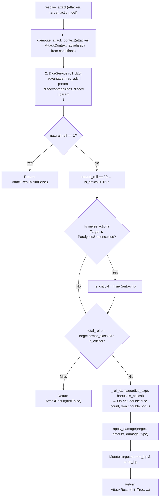
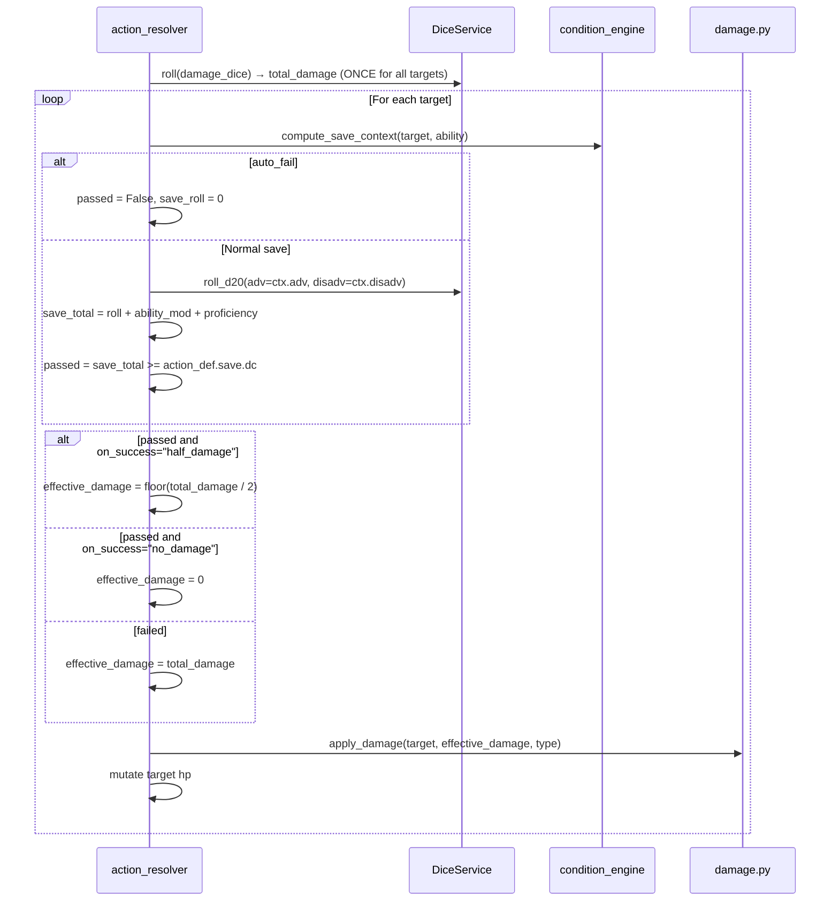
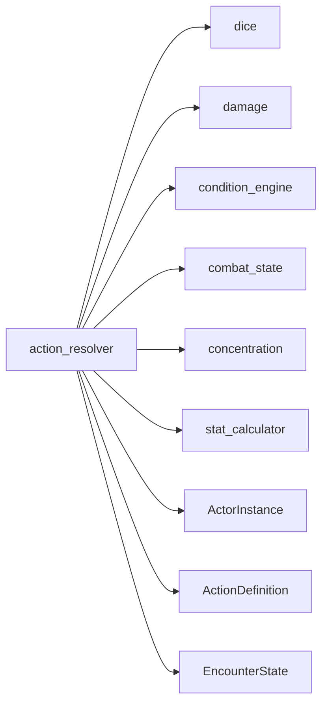

# Module 06 — Action Resolver

> **As-Is Documentation** | File: `systems/dnd5e/engine/action_resolver.py`

## Overview

The Action Resolver is the highest-level pure rules engine component. It **composes** all the stateless engines (dice, damage, condition, concentration, combat_state) into three complete resolution pipelines: **attack**, **save-based action**, and **healing**. A fourth convenience wrapper `resolve_and_apply()` integrates with the `EncounterState`.

---

## Pipeline Composition Map



---

## Result Models

```python
class AttackResult(BaseModel):
    hit: bool
    is_critical: bool = False
    roll_used: int = 0        # Natural d20 value used
    roll_count: int = 1       # 1 for normal, 2 for adv/disadv
    total_damage: int = 0
    damage_result: Optional[DamageResult] = None

class SaveTargetResult(BaseModel):
    target_id: str
    passed: bool
    save_roll: int            # Natural d20 value
    damage: int               # Effective damage applied

class SaveActionResult(BaseModel):
    results: List[SaveTargetResult]

class HealingResult(BaseModel):
    hp_restored: int
    new_hp: int
```

---

## `resolve_attack()` Pipeline



### PHB Critical Hit Rules
- Natural 20: always a critical hit
- Paralyzed or Unconscious target in melee: auto-crit
- On crit: **dice count** is doubled; the flat damage bonus is NOT doubled

---

## `resolve_save_action()` Pipeline

Used for AoE spells, breath weapons, and any save-based effect (e.g. Fireball, Dragon Breath).



### Save Calculation Detail
```
save_total = save_roll + ability_modifier(target, save.ability) + target.proficiency_bonus
```

> [!NOTE]
> Proficiency bonus is **always** added here. Proper proficiency tracking (where only proficient saves add the bonus) is a known gap — see `backend_todos.md`.

---

## `resolve_healing()` Pipeline

```python
def resolve_healing(target, action_def, *, dice_override=None) -> HealingResult:
    heal_total = DiceService.roll(action_def.damage_dice).total + (action_def.damage_bonus or 0)
    target.current_hp = min(target.max_hp, target.current_hp + heal_total)
    # Returns HealingResult with hp_restored and new_hp
```

HP is capped at `max_hp`. Cannot over-heal.

---

## `resolve_and_apply()` — Encounter Integration

The `resolve_and_apply()` wrapper ties the pure attack resolver into the encounter state:

1. Calls `resolve_attack()`
2. Calls `get_turn_budget(encounter, attacker.id).use_action()`
3. If the target took damage AND is concentrating: computes `concentration_dc(damage)` — **currently only flagged; the actual CON save is not auto-resolved**

> [!WARNING]
> The CON save for concentration checks inside `resolve_and_apply()` is **stubbed with a `pass`**. The ws_handler is expected to trigger the save separately. This is tracked in `backend_todos.md`.

---

## Dependencies


