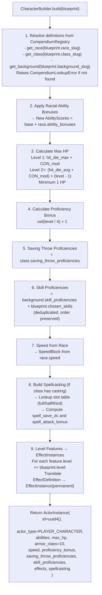
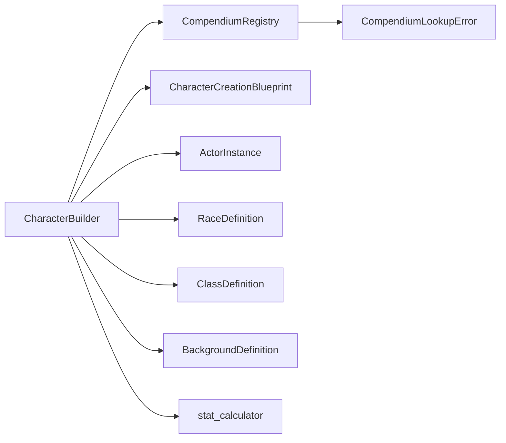

# Module 07 — Character Builder

> **As-Is Documentation** | File: `systems/dnd5e/engine/character_builder.py`, `systems/dnd5e/schemas/creation.py`

## Overview

The Character Builder is a dedicated module that accepts a high-level `CharacterCreationBlueprint` as input and produces a fully initialized, combat-ready `ActorInstance` as output. It orchestrates definition lookups from the `CompendiumRegistry` and applies PHB rules for HP, proficiency, speed, spellcasting, and level features.

---

## Build Pipeline



---

## Input: `CharacterCreationBlueprint`

```python
class CharacterCreationBlueprint(BaseModel):
    name: str
    race_slug: str          # e.g. "half-orc"
    class_slug: str         # e.g. "barbarian"
    background_slug: str    # e.g. "outlander"
    level: int              # 1–20
    base_abilities: AbilityScores
    chosen_skills: List[str] = []
```

---

## Output: `ActorInstance`

The resulting `ActorInstance` is a fully initialized combat-ready object. Below is a summary of what the CharacterBuilder sets vs what defaults remain:

| Field | Source |
|---|---|
| `id` | `uuid4()` generated |
| `actor_type` | Always `PLAYER_CHARACTER` |
| `name` | From blueprint |
| `abilities` | base_abilities + racial bonuses |
| `current_hp`, `max_hp` | Calculated from class hit die + CON mod |
| `temp_hp` | Default `0` |
| `armor_class` | Default `10` (NOT calculated from equipment) |
| `speed` | From `RaceDefinition.speed` |
| `proficiency_bonus` | Derived from level |
| `saving_throw_proficiencies` | From class definition |
| `skill_proficiencies` | Background + chosen, deduplicated |
| `effects` | Level features translated to permanent `EffectInstance` |
| `spellcasting` | Built from class progression, or `None` |
| `resources` | Default empty `ResourcePool` |
| `concentration` | Default `is_concentrating=False` |
| `inventory` | Default empty `[]` |

> [!IMPORTANT]
> `armor_class` is hardcoded to `10`. Equipment-based AC calculation is **not implemented**. The actor must receive an AC override separately (e.g., via a DM apply_stat override or an EffectInstance from a feature).

---

## Spellcasting Construction

`_build_spellcasting()` selects the correct PHB slot progression table based on `ClassDefinition.spellcasting.type`:

| `type` | Progression Table |
|---|---|
| `"full"` | Full caster (Wizard, Cleric, Bard, etc.) |
| `"half"` | Half caster (Paladin, Ranger) |
| `"third"` | Third caster (Eldritch Knight, Arcane Trickster) |

Spell DC: `8 + proficiency_bonus + ability_modifier`
Spell Attack: `proficiency_bonus + ability_modifier`

---

## Level Feature Translation

Class `LevelFeature` objects up to the character's level are converted into permanent `EffectInstance` objects and injected into `actor.effects`:

```python
EffectInstance(
    id=uuid4(),
    name=effect_def.name,
    type=effect_def.type,          # e.g. BONUS, SET
    target_stat=effect_def.target_stat,  # e.g. "armor_class"
    value=effect_def.value,
    source_id="class_feature",
    duration_type=DurationType.PERMANENT,
)
```

These permanent effects are then picked up by `compute_stats()` in the rules engine during actual play.

---

## HP Calculation Rules

| Level | Formula |
|---|---|
| 1 | `hit_die_max + CON_modifier` |
| 2+ | Level1 HP + `(hit_die_average + CON_modifier) × (level - 1)` |

Hit die averages used (rounded up, PHB convention):
- `d6` → 4, `d8` → 5, `d10` → 6, `d12` → 7

---

## Dependencies


