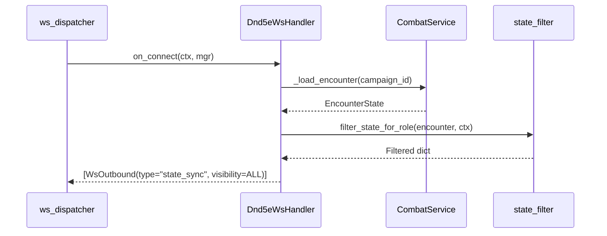
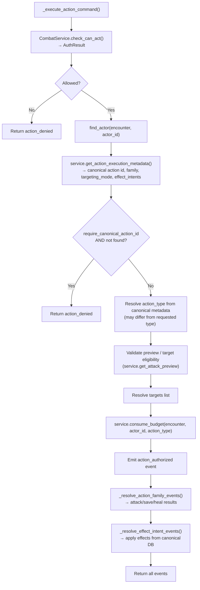
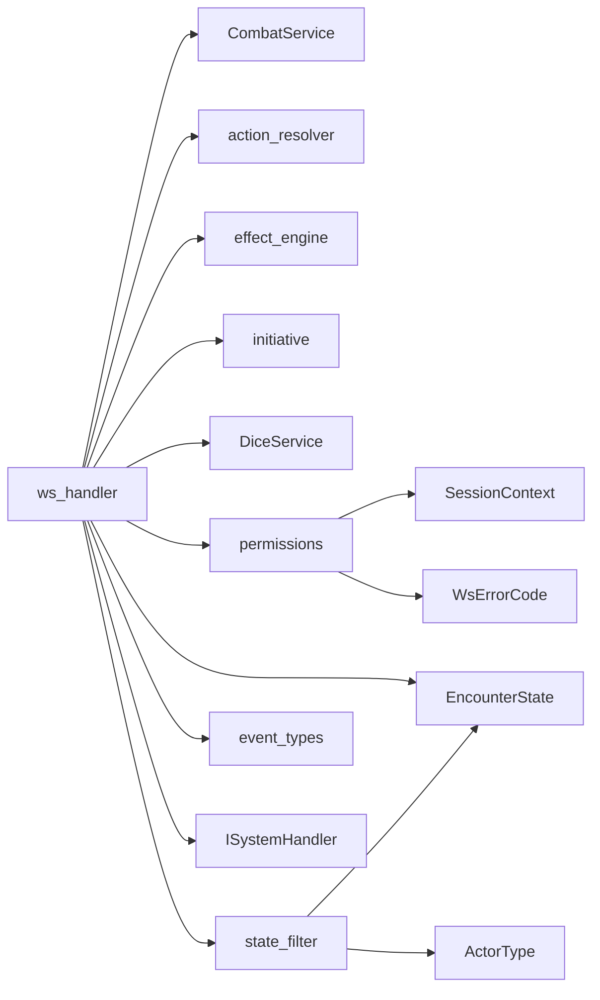

# Module 08 — WebSocket Handler (D&D 5e)

> **As-Is Documentation** | Files: `systems/dnd5e/ws_handler.py`, `permissions.py`, `state_filter.py`, `event_types.py`

## Overview

The `Dnd5eWsHandler` is the concrete implementation of `ISystemHandler` for the D&D 5e game system. It routes all inbound WebSocket events, enforces role permissions, coordinates with the `CombatService`, invokes game engine pipelines, applies Fog of War filtering, and returns the resulting outbound event lists.

> [!WARNING]
> `ws_handler.py` is currently ~100KB due to leaked business logic (targeting validation, budget double-checks, effect intent resolution). A refactor to push this into `CombatService` is tracked in `backend_todos.md`.

---

## Connection Lifecycle



---

## Event Permission Matrix

### DM-Only Events
```
action, start_combat, end_combat, end_turn,
add_actor, remove_actor,
apply_damage, apply_healing,
apply_condition, remove_condition
```

### DM or Actor Owner Events
```
move_token, request_action,
request_move_preview, request_executable_actions,
request_attack_preview
```

### All Users
```
roll_dice, chat_message, ping, request_sync
```

### Request ID Requirement
All events in `COMMAND_EVENT_TYPES` require a `request_id` in the envelope. If missing, an immediate `error` is returned.

---

## Event Dispatch Map

| Inbound Event | Handler Method | Notes |
|---|---|---|
| `ping` | `_handle_ping` | Returns `pong` to sender |
| `request_sync` | `_handle_request_sync` | Returns filtered `state_sync` to sender only |
| `roll_dice` | `_handle_roll_dice` | Broadcasts `dice_rolled` to all |
| `chat_message` | `_handle_chat_message` | Broadcasts `chat_message` to all |
| `action` | `_handle_action` | DM executes action directly |
| `request_action` | `_handle_request_action` | Player requests action; DM can impersonate |
| `request_executable_actions` | `_handle_request_executable_actions` | Returns list of available actions for an actor |
| `request_attack_preview` | `_handle_request_attack_preview` | Returns eligible targets + template projection |
| `request_move_preview` | `_handle_request_move_preview` | Returns reachable cells for a move |
| `move_token` | `_handle_move_token` | Moves actor token, saves state |
| `add_actor` | `_handle_add_actor` | Adds monster/NPC via definition slug |
| `remove_actor` | `_handle_remove_actor` | Removes actor from encounter |
| `end_turn` | `_handle_end_turn` | Advances combat state machine |
| `start_combat` | `_handle_start_combat` | Rolls initiatives, sets turn_phase=active |
| `end_combat` | `_handle_end_combat` | Sets turn_phase=post_combat |
| `apply_damage` | `_handle_apply_damage` | DM override: direct HP reduction |
| `apply_healing` | `_handle_apply_healing` | DM override: direct HP increase |
| `apply_condition` | `_handle_apply_condition` | DM override: add condition to actor |
| `remove_condition` | `_handle_remove_condition` | DM override: remove condition from actor |

---

## `_execute_action_command()` — Action Execution Flow

This central internal method handles both `action` and `request_action` events:



---

## `state_filter.py` — Fog of War

Transforms the raw `EncounterState` into a role-appropriate JSON dict.

```python
def filter_state_for_role(encounter, ctx) -> dict[str, Any]:
    if ctx.role == UserRole.DM:
        return encounter.model_dump(mode="json")   # Full state
    return _player_view(encounter, ctx.user_id)    # Filtered
```

### Player View Filtering
For each combatant with `actor_type` of `monster` or `npc`:
- `current_hp`, `max_hp`, `temp_hp` → **removed**
- `abilities`, `spellcasting`, `resources`, `exhaustion_level` → **removed**
- `health_status` → **added** (string descriptor)

### Health Status Descriptors

| HP Ratio | Descriptor |
|---|---|
| ≥ 100% | `"healthy"` |
| ≥ 75% | `"lightly wounded"` |
| ≥ 50% | `"bloodied"` |
| ≥ 25% | `"badly wounded"` |
| > 0% | `"near death"` |
| 0 | `"dead"` |

---

## DM Impersonation

The DM can simulate player-level permission checks for debugging. If a `request_action` event contains `acting_as_user_id`, and the sender is DM, a temporary `SessionContext` with `role=PLAYER` and the specified user_id is used for the downstream permission checks:

```python
@staticmethod
def _resolve_impersonated_ctx(ctx, acting_as_user_id) -> SessionContext:
```

---

## Encounter Storage (MVP Gap)

```python
# In-memory dict — NOT persisted to database
_encounters: dict[str, EncounterState] = {}

def get_or_create_encounter(campaign_id) -> EncounterState:
    """If not in memory, creates a HARDCODED default encounter (Arannis + Goblin)."""
```

> [!CAUTION]
> The fallback `get_or_create_encounter()` creates a hardcoded test encounter with `Arannis` and `Goblin`. This is **MVP scaffolding** and must be replaced with proper DB-backed loading. Tracked in `backend_todos.md`.

---

## Dependencies


