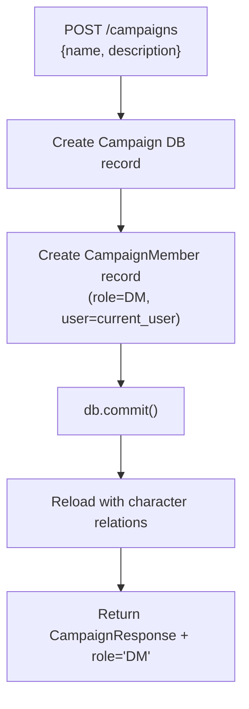
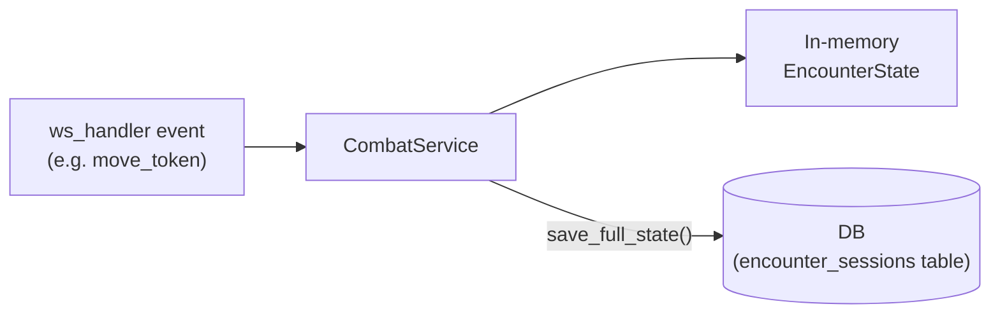
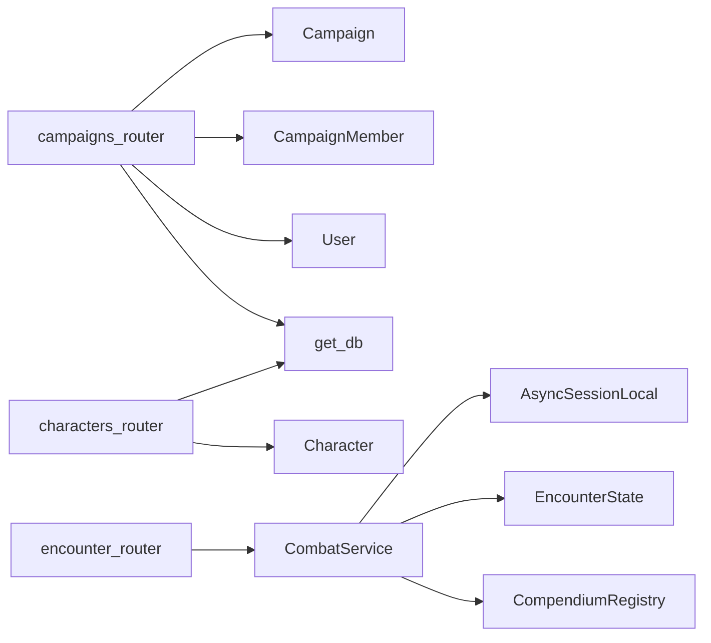

# Module 09 — Campaign API & Combat Service

> **As-Is Documentation** | Files: `campaigns/routers/campaigns.py`, `campaigns/routers/characters.py`, `systems/dnd5e/services/combat_service.py`, `systems/dnd5e/encounter_router.py`

## Overview

The Campaign API provides the REST endpoints for managing campaigns, player membership, and characters. The `CombatService` is the database-integrated service layer that bridges the WebSocket engine with persistent encounter state via SQLAlchemy.

---

## Campaign REST API

**Base path:** `/campaigns`

| Method | Path | Auth Required | Description |
|---|---|---|---|
| `POST` | `/campaigns` | ✅ | Create a new campaign, auto-joins creator as DM |
| `GET` | `/campaigns` | ✅ | List all campaigns the user is a member of |
| `GET` | `/campaigns/{id}` | ✅ | Get a single campaign (must be member) |
| `POST` | `/campaigns/{id}/join` | ✅ | Join a campaign as PLAYER |
| `DELETE` | `/campaigns/{id}` | ✅ (DM only) | Delete a campaign |

### Campaign Creation Flow



### Access Control
- **Admin users** (username matches `settings.ADMIN_USERNAME` or `is_superuser=True`) bypass membership checks and see all campaigns as DM
- Regular users only see campaigns they are members of

---

## Character REST API

**Base path:** `/characters`

| Method | Path | Description |
|---|---|---|
| `POST` | `/characters` | Create a character |
| `GET` | `/characters` | List characters (filter by `player_id`, `campaign_id`) |
| `GET` | `/characters/{id}` | Get single character with class/race/background relations |
| `PUT` | `/characters/{id}` | Update all character fields |
| `DELETE` | `/characters/{id}` | Delete character |

> [!WARNING]
> The `GET /characters?player_id=` filter uses the `player_name` column as the identity field, which is a legacy naming issue. There is no actual `player_id` column on the `Character` model. The filter currently passes silently without actually filtering. Tracked in `backend_todos.md`.

---

## ORM Models

### `Campaign`
```python
class Campaign(Base):
    id: str          # UUID
    name: str
    description: str
    dm_id: str       # Legacy column kept for compatibility
    characters: List[Character]  # relationship
```

### `CampaignMember`
```python
class CampaignMember(Base):
    campaign_id: str
    user_id: UUID
    role: CampaignRole   # DM | PLAYER
```

### `Character`
```python
class Character(Base):
    id: str
    name: str
    player_name: str     # Intended to store user identifier
    campaign_id: str
    species: -> SpeciesDefinition (relationship)
    char_class: -> ClassDefinition (relationship)
    background: -> BackgroundDefinition (relationship)
```

---

## `CombatService`

The service layer between `ws_handler` and the database/engine. Uses `AsyncSession`.

### Key Methods

```python
class CombatService:
    async def _load_session(campaign_id) -> EncounterSession
    async def save_full_state(session, encounter) -> None
    async def check_can_act(session, encounter, actor_id, action_type, ctx) -> AuthResult
    async def consume_budget(session, encounter, actor_id, action_type) -> None
    async def get_turn_budget_snapshot(session, encounter) -> dict
    async def get_action_execution_metadata(encounter, actor_id, action_name) -> ActionMeta
    async def get_attack_preview(session, encounter, ctx, actor_id, action_name, ...) -> PreviewResult
    async def log_action_attempt(session, ...) -> None
    def normalize_action_type(action_type_str) -> str
```

### State Persistence Pattern


Not all events persist. Only mutating events call `save_full_state()`:
- `move_token`, `add_actor`, `remove_actor`
- `end_turn`, `start_combat`, `end_combat`
- `apply_damage`, `apply_healing`, `apply_condition`, `remove_condition`

Read-only events (`request_attack_preview`, `request_executable_actions`, etc.) do not persist.

---

## `encounter_router.py` — REST Encounter Management

**Base path:** `/encounter` (not under `/campaigns`)

Provides REST endpoints for direct encounter state management (separate from WebSocket control):

| Method | Path | Description |
|---|---|---|
| `GET` | `/encounter/{campaign_id}` | Get current encounter state |
| `POST` | `/encounter/{campaign_id}/start` | Initialize encounter |
| `POST` | `/encounter/{campaign_id}/actors` | Add actor |
| `DELETE` | `/encounter/{campaign_id}/actors/{id}` | Remove actor |

---

## Dependencies


