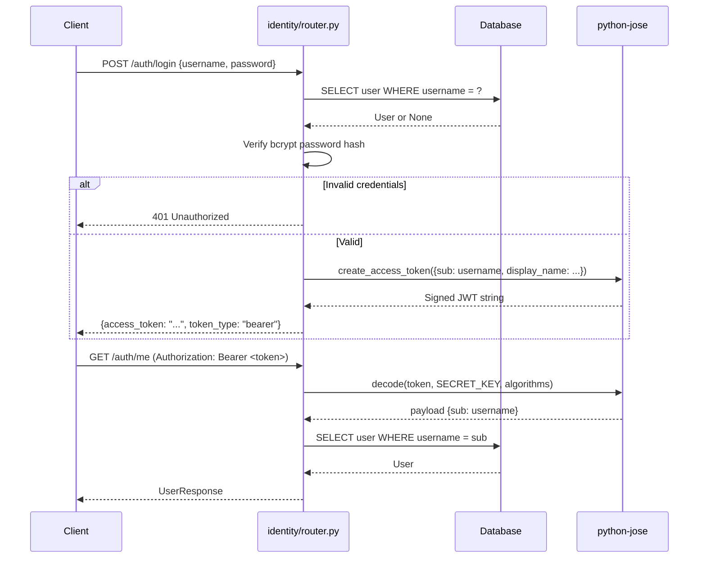
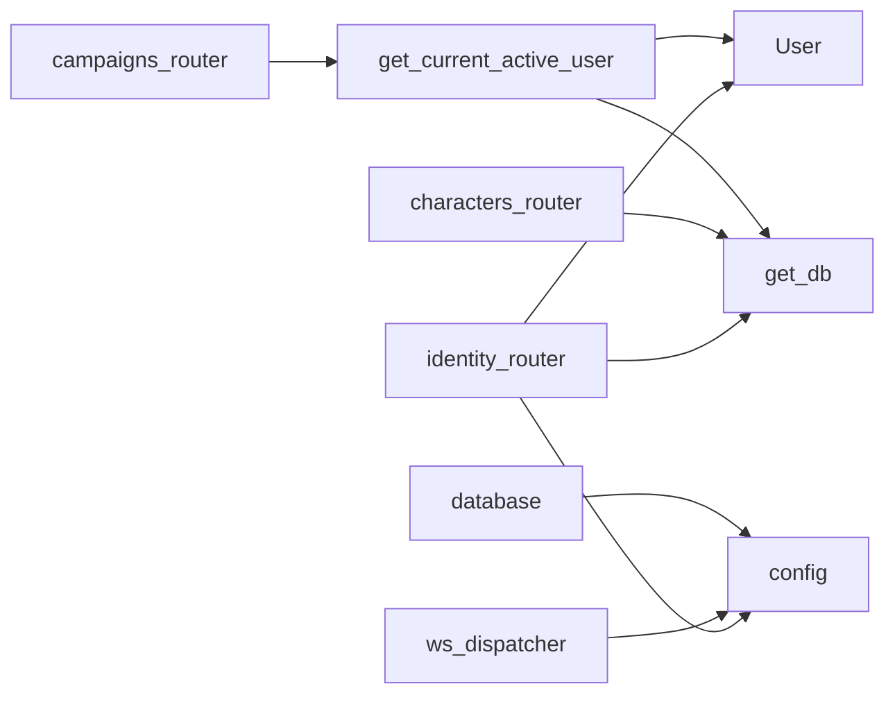

# Module 10 — Identity & Auth

> **As-Is Documentation** | Files: `identity/router.py`, `identity/models.py`, `identity/dependencies.py`, `config.py`, `database.py`

## Overview

Handles user authentication, JWT token issuance, and user session management. Built using FastAPI with SQLAlchemy async ORM and `python-jose` for JWT. All protected endpoints use a `Depends(get_current_active_user)` guard.

---

## Auth Flow



---

## Key Endpoints

**Base path:** `/auth`

| Method | Path | Auth | Description |
|---|---|---|---|
| `POST` | `/auth/register` | ❌ | Register new user |
| `POST` | `/auth/login` | ❌ | Login, returns access token |
| `GET` | `/auth/me` | ✅ | Get current user info |

---

## `User` ORM Model

```python
class User(Base):
    id: UUID
    username: str       # Unique
    email: str          # Unique (optional)
    hashed_password: str
    display_name: str
    is_active: bool = True
    is_superuser: bool = False
```

---

## JWT Configuration

Controlled via `config.py` (loaded from `.env`):

| Setting | Description |
|---|---|
| `SECRET_KEY` | Signing secret for JWT |
| `ALGORITHM` | `"HS256"` |
| `ACCESS_TOKEN_EXPIRE_MINUTES` | Default 30 |
| `ADMIN_USERNAME` | Username that receives admin bypass in campaign routes |

---

## WebSocket Auth Integration

JWT tokens are passed as query parameters to the WebSocket endpoint:
```
/ws/{campaign_id}?token=<JWT>&role=<player|dm>
```

The `ws_dispatcher.py` calls `_validate_token(token)` to decode:
- Valid JWT → extracts `sub` (user_id) and `display_name`
- Invalid JWT → closes connection with code `4001`
- `"dev-token"` special value → bypasses validation (dev mode only)

Role assignment (`DM` vs `PLAYER`) is determined by the `role` query param, **not derived from the JWT payload**. This is a known security gap — the role is self-declared by the client.

> [!CAUTION]
> The `role` query param is user-supplied and not validated against the DB `CampaignMember.role`. All game logic correctly gates DM-only actions behind `check_permission()`, but the initial role elevation via URL param is not protected. See `backend_todos.md`.

---

## `database.py` — Async Database Connection

```python
# Async SQLAlchemy engine
engine = create_async_engine(settings.DATABASE_URL, echo=False)
AsyncSessionLocal = async_sessionmaker(engine, class_=AsyncSession)

# Base for all ORM models
Base = declarative_base()

# FastAPI dependency for DB sessions
async def get_db() -> AsyncGenerator[AsyncSession, None]:
    async with AsyncSessionLocal() as session:
        yield session
```

### Startup Table Creation
```python
# In main.py lifespan
async with engine.begin() as conn:
    await conn.run_sync(Base.metadata.create_all)
```

---

## Dependencies


