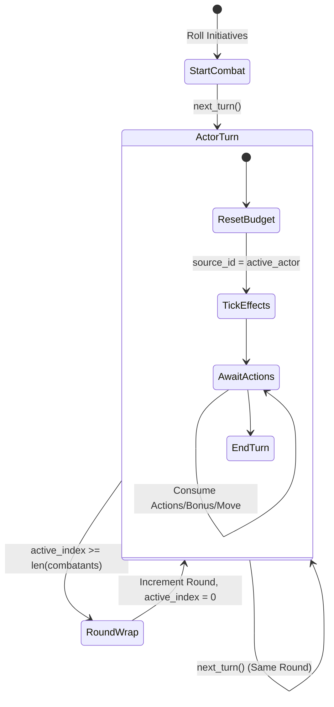

# 04. Combat State Machine

## 1. Overview

The Combat State Machine controls the temporal flow of an encounter, managing initiative order, turn progression, and resource pools like actions, bonus actions, and movement. Furthermore, it is responsible for ticking effect durations across rounds and handling the rules for breaking or maintaining spell concentration.

## 2. Core Concepts / Mechanics

- **Initiative & Turn Progression**: Initial combat setup rolls a d20 and adds the DEX modifier, breaking any exact ties using the raw DEX score. Once sorted, the engine leverages an active index over the combatants array, naturally looping into the next round when reaching its end.
- **Turn Budgets**: Every participant receives a dedicated `TurnBudget`. At the very start of a character's turn, their action, bonus action, and movement values are completely replenished. Following PHB rules, a character's reaction also strictly refreshes at the top of their own turn.
- **Effect Ticking**: The effect engine ticks on a per-source tracking basis. When an actor begins or concludes a turn, any effects they created update their `remaining_rounds`. Expired effects are immediately truncated alongside any mechanically linked rules (like `ConditionType`).
- **Concentration Rules**: Utilizing the effect engine, a character beginning a new concentration effect inherently severs their prior one. Sustaining damage determines the saving throw DC via `max(10, floor(damage / 2))`. Additionally, enduring incapacitating conditions (Incapacitated, Paralyzed, Petrified, Stunned, Unconscious) instantly terminates concentration.



## 3. Key Schemas / Interfaces

- **`InitiativeEntry`**: Bundles a participant's `actor_id`, final evaluated `roll`, and `dex_score` (utilized purely for deterministic tie-breaking).
- **`TurnBudget`**: The core resource tracker holding true/false flags for `action_available`, `bonus_action_available`, `reaction_available`, and evaluating integer values for `movement_remaining`.
- **`ConcentrationState`**: A sub-schema belonging inherently to an `ActorInstance`, reflecting an `is_concentrating` boolean and the particular `effect_id` anchoring it.

## 4. Example Usage

```python
from systems.dnd5e.engine import combat_state, initiative, effect_engine

# Start combat having rolled standard initiatives
combat_state.start_combat(encounter_state, [
    initiative.roll_initiative(goblin),
    initiative.roll_initiative(fighter)
])

# Attempt to consume an action for the active combatant
budget = combat_state.get_turn_budget(encounter_state, fighter.id)
if budget.action_available:
    budget.use_action()
    print("Action consumed!")

# Proceed to the next turn, automatically resetting budgets and allowing effects to tick
combat_state.next_turn(encounter_state)
effect_engine.tick_effects(encounter_state, source_id=fighter.id)
```

## 5. Dependencies

- `schemas/instances.py` (ActorInstance, EffectInstance, ConcentrationState)
- `schemas/encounter.py` (EncounterState)
- `engine/dice.py` (For initiative resolution and advantage/disadvantage)
- `engine/stat_calculator.py` (For calculating DEX modifiers to determine initiative bonuses)
