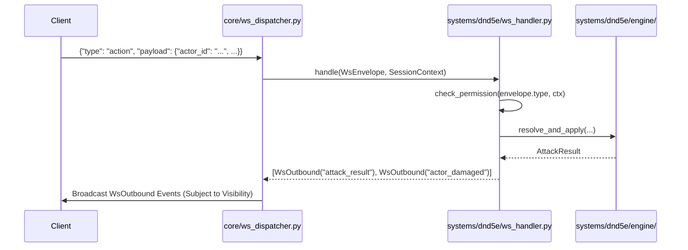

# 07. WebSocket API and Sessions

## 1. Overview

The WebSocket subsystem handles real-time bidirectional communication between the VTT frontend and the D&D 5e engine. It wraps all payloads in a generic envelope to enforce a strict and predictable contract. This layer is responsible for authenticating sessions, enforcing role-based permissions (DM vs. Player logic), routing discrete event actions into the core engine components, and rigorously filtering sensitive outbound state updates via Fog of War principles.

## 2. Core Concepts / Mechanics

- **Envelopes**: Every inbound message from the client is wrapped in a `WsEnvelope` specifying a fixed `type` alongside a flexible JSON `payload`. The server reciprocates using a `WsOutbound` envelope that also specifies a `visibility` rule.
- **Visibility & State Filtering**: Outbound events can be broadcast selectively: `ALL`, `DM_ONLY`, `ACTOR_OWNER`, or `EXCLUDE_ACTOR`. When syncing the master `EncounterState` down to a player context, `filter_state_for_role` strips away sensitive DM knowledge (hidden monsters, exact enemy HP values).
- **Role-Based Routing**: Before an inbound message invokes an engine function, it passes through `check_permission()`. This guarantees, for example, that only the DM can trigger overarching state shifts like `start_combat`, while a standard user is strictly confined to moving their owned tokens or executing their own attacks.
- **Handler Dispatch**: The `Dnd5eWsHandler` manages the lifecycle of the connection and delegates inbound traffic through to functions inside Phase 2–4 modules (`action_resolver`, `combat_state`, `dice`, etc.).



## 3. Key Schemas / Interfaces

- **`WsEnvelope`**: The base inbound structure containing `type` (e.g., `"roll_dice"`) and a `payload` dictionary.
- **`WsOutbound`**: The base outbound structure containing `type`, `payload`, `visibility`, and an optional `target_user_id` when targeting specific ownership.
- **Inbound Event Dictionary (Selection)**:
  - `action`: Triggers an attack, spell, or ability (relies on `ActionPayload`).
  - `roll_dice`: Evaluates standard dice expressions (`RollDicePayload`).
  - `end_turn`: Progresses the combat state machine (`EndTurnPayload`).
  - `start_combat` / `end_combat`: Overarching state control.
  - `apply_damage` / `apply_healing` / `apply_condition`: Direct DM manipulations over an encounter.
- **Outbound Event Dictionary (Selection)**:
  - `state_sync`: Full transmission of the filtered encounter state.
  - `turn_advanced`: Signals that the active index looped and announces the new actor.
  - `actor_damaged` / `actor_died` / `condition_added`: Mechanical side-effects broadcast heavily.
  - `error`: Formal `WsErrorCode` failure notices (e.g., `UNAUTHORIZED`, `INVALID_ACTION`).

## 4. Example Usage

**Client sending an action payload:**

```json
{
  "type": "apply_damage",
  "payload": {
    "actor_id": "goblin_123",
    "amount": 14,
    "damage_type": "slashing"
  }
}
```

**Server broadcasting a resulting state update:**

```json
{
  "type": "actor_damaged",
  "payload": {
    "actor_id": "goblin_123",
    "amount": 14,
    "new_hp": 0,
    "source": "dm_override"
  },
  "visibility": "all",
  "target_user_id": null
}
```

_(Optionally followed by an `actor_died` broadcast)._

## 5. Dependencies

- `core/ws_protocol.py` (Envelope formatting, error enums, and visibility definitions)
- `systems/dnd5e/ws_handler.py` (The main dispatcher logic mapping event types to engine commands)
- `systems/dnd5e/event_types.py` (The Pydantic definitions for all payloads)
- `systems/dnd5e/permissions.py` (Role checks)
- `systems/dnd5e/state_filter.py` (Fog of war logic prior to dispatching `state_sync`)
