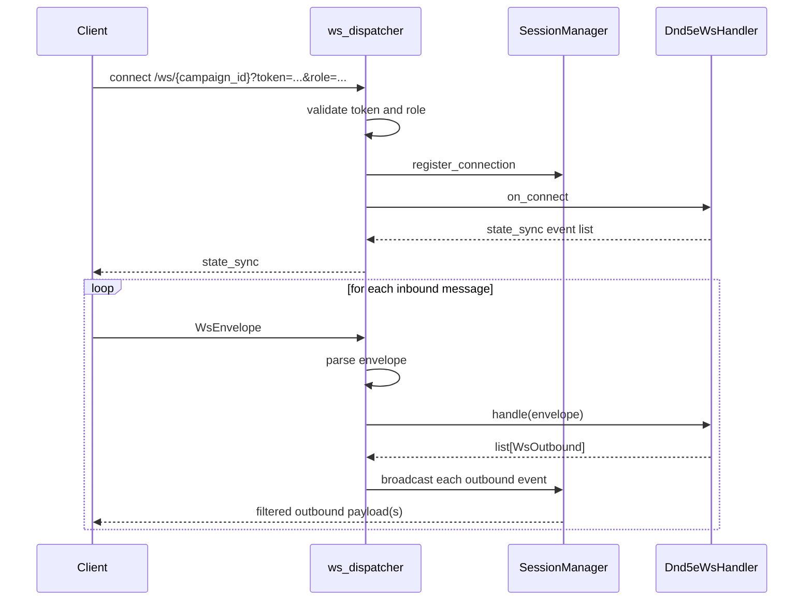
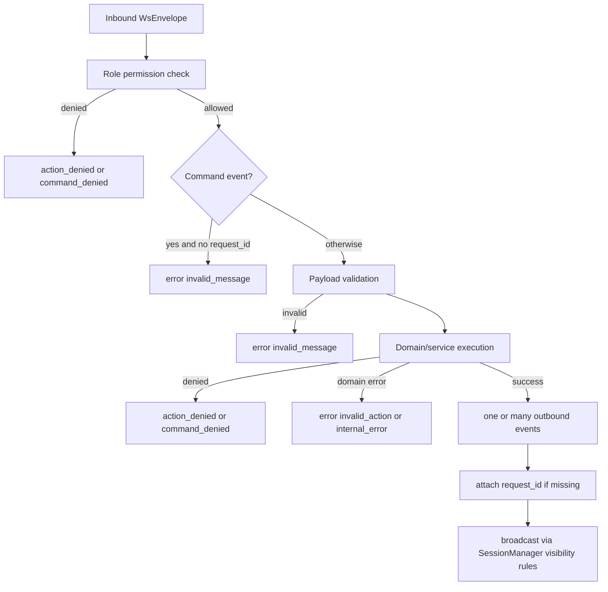
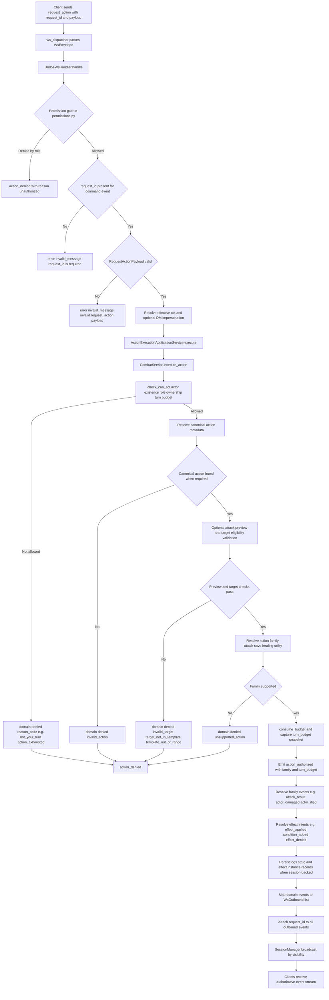

# CMV2 DnD5e Event Specification (Code-First)

Status: authoritative as-built snapshot from runtime code on March 23, 2026.

## 1. Scope and Sources

This document specifies the WebSocket event system for the DnD5e backend implementation.
It is based on runtime code, not planning docs.

Primary source files:

- `backend/src/core/ws_dispatcher.py`
- `backend/src/core/ws_protocol.py`
- `backend/src/core/sessions/manager.py`
- `backend/src/core/sessions/models.py`
- `backend/src/systems/dnd5e/permissions.py`
- `backend/src/systems/dnd5e/ws_handler.py`
- `backend/src/systems/dnd5e/event_types.py`
- `backend/src/systems/dnd5e/services/combat_service.py`
- `backend/src/systems/dnd5e/reason_codes.py`
- `backend/src/systems/dnd5e/domain/action_economy.py`

## 2. Transport Contract

### 2.1 Endpoint

- Route: `GET /ws/{campaign_id}`
- Query parameters:
  - `token`: required JWT (or dev-token bypass)
  - `role`: `dm`, `player`, `spectator` (invalid values fallback to `player`)

### 2.2 Envelope Shapes

Inbound envelope (client to server):

```json
{
  "type": "event_name",
  "request_id": "optional-string",
  "payload": {}
}
```

Outbound envelope (server to client):

```json
{
  "type": "event_name",
  "request_id": "optional-string",
  "payload": {}
}
```

Internal transport metadata (not sent to clients):

- `visibility`: `all`, `dm_only`, `actor_owner`, `exclude_actor`
- `target_user_id`: used by `actor_owner` and `exclude_actor`

### 2.3 Connection and Dispatch Lifecycle



## 3. Permission and Command Rules

### 3.1 Role Gate

Role checks are done in `permissions.py` before event-specific handling.

DM-only inbound events:

- `action`
- `start_combat`
- `end_combat`
- `end_turn`
- `add_actor`
- `remove_actor`
- `apply_damage`
- `apply_healing`
- `apply_condition`
- `remove_condition`

DM-or-owner category (role gate allows player, ownership checked later in service):

- `move_token`
- `request_action`
- `request_move_preview`
- `request_executable_actions`
- `request_attack_preview`

All users:

- `roll_dice`
- `chat_message`
- `ping`
- `request_sync`

Important runtime nuance:

- Unknown `event_type` values are not denied by permission layer.
- Unknown events are rejected later in `ws_handler` with outbound `error` (`invalid_message`).

### 3.2 Command request_id Requirement

Handler-level command list (`ws_handler.py`) requires `request_id`:

- `action`
- `request_action`
- `request_executable_actions`
- `request_attack_preview`
- `request_move_preview`
- `move_token`
- `add_actor`
- `remove_actor`
- `start_combat`
- `end_combat`
- `end_turn`
- `apply_damage`
- `apply_healing`
- `apply_condition`
- `remove_condition`

If missing, terminal response is:

- `error` with `code=invalid_message`

Dispatcher note:

- `ws_dispatcher.py` also keeps its own `COMMAND_EVENT_TYPES` set for warning logs.
- That dispatcher set currently omits preview commands, so logging policy and handler contract are slightly out of sync.

## 4. Visibility Delivery Rules

SessionManager delivery behavior:

- `all`: every connected user in campaign room
- `dm_only`: only users with role `dm`
- `actor_owner`: DM always receives, plus matching `target_user_id`
- `exclude_actor`: all except `target_user_id`

Practical implications:

- Most gameplay events are emitted as `all`.
- `pong` and targeted errors/denials are usually `actor_owner`.

## 5. Inbound Event Specification

## 5.1 Utility and Sync

### `ping`

- Payload: `{}`
- Request ID required: no
- Success outbound:
  - `pong` (visibility `actor_owner`)
- Error paths:
  - none specific

### `request_sync`

- Payload: `{}`
- Request ID required: no
- Success outbound:
  - `state_sync` (filtered by role, visibility `actor_owner`)

### `roll_dice`

- Payload model: `RollDicePayload`
  - `expression: str`
  - `purpose?: str`
- Request ID required: no
- Success outbound:
  - `dice_rolled` (visibility `all`)
- Error outbound:
  - `error` (`invalid_message`) on schema failure

### `chat_message`

- Payload model: `ChatMessagePayload`
  - `message: str`
- Request ID required: no
- Success outbound:
  - `chat_message` payload includes sender metadata and trimmed message
- Error outbound:
  - `error` (`invalid_message`) for schema failure or empty message

## 5.2 Action Commands

### `action`

- Payload model: `ActionPayload`
  - `actor_id: str`
  - `action_name: str` (treated as canonical action_id)
  - `action_type: str` (normalized by domain action economy)
  - `target_ids: list[str]`
- Request ID required: yes
- Handler path:
  - ActionExecutionApplicationService -> CombatService.execute_action
- Terminal outcomes:
  - success event stream begins with `action_authorized`, then resolution events
  - `action_denied` on domain denial
  - `error` on domain error

### `request_action`

- Payload model: `RequestActionPayload`
  - `actor_id: str`
  - `action_type: str`
  - `action_name: str`
  - `payload: dict`
  - `acting_as_user_id?: str` (DM impersonation)
- Request ID required: yes
- Special behavior:
  - DM can impersonate a player context for auth checks
  - target_ids are extracted from `payload.target_ids`
- Terminal outcomes: same pattern as `action`

### Action resolution event families currently emitted

From CombatService domain flow:

- `action_authorized`
- `attack_result`
- `save_result`
- `actor_damaged`
- `actor_died`
- `actor_healed`
- `effect_applied`
- `effect_removed`
- `effect_refreshed`
- `effect_denied`
- `effect_tick_resolved`
- `condition_added`
- `condition_removed`

Domain `denied` maps to transport `action_denied`.
Domain `error` maps to transport `error` (`invalid_action`).

## 5.3 Preview Commands

### `request_executable_actions`

- Payload model: `RequestExecutableActionsPayload`
  - `actor_id: str`
  - `acting_as_user_id?: str`
- Request ID required: yes
- Success outbound:
  - `executable_actions_snapshot`
  - payload:
    - `actor_id`
    - `actions[]` including availability and canonical metadata
    - `turn_budget` (budget map)
- Denied outbound:
  - `command_denied` (event_type `request_executable_actions`)

### `request_attack_preview`

- Payload model: `RequestAttackPreviewPayload`
  - `actor_id: str`
  - `action_id: str`
  - `template_origin?: {x,y}`
  - `template_direction?: {x,y}`
  - `acting_as_user_id?: str`
- Request ID required: yes
- Success outbound:
  - `attack_preview`
  - payload:
    - `actor_id`, `action_id`, `origin`
    - `eligible_target_ids[]`
    - `eligible_cells[]`
    - `template_projection?`
- Denied outbound:
  - `command_denied` (event_type `request_attack_preview`)

### `request_move_preview`

- Payload model: `RequestMovePreviewPayload`
  - `actor_id: str`
  - `acting_as_user_id?: str`
- Request ID required: yes
- Success outbound:
  - `movement_preview`
  - payload:
    - `actor_id`, `origin`
    - `movement_remaining`
    - `reachable[]`
- Denied outbound:
  - `command_denied` (event_type `request_move_preview`)

## 5.4 Movement and Encounter Mutation Commands

### `move_token`

- Payload model: `MoveTokenPayload`
  - `actor_id: str`
  - `path: [{x,y}, ...]`
  - `acting_as_user_id?: str`
- Request ID required: yes
- Success outbound:
  - `actor_moved` payload includes `path`, final `position`, and `turn_budget`
- Denied/error outbound:
  - `command_denied` for semantic auth/budget denial
  - `error` (`invalid_target`, `invalid_action`, or `invalid_message`) for invalid target/schema/path issues

### `add_actor`

- Payload model: `AddActorPayload`
  - `definition_slug: str`
  - `name?: str`
  - `position?: {x,y}`
  - `owner_user_id?: str`
- Request ID required: yes
- Success outbound:
  - `actor_added`
- Error outbound:
  - `error` (`invalid_message` or `invalid_action`)

### `remove_actor`

- Payload model: `RemoveActorPayload`
  - `actor_id: str`
- Request ID required: yes
- Success outbound:
  - `actor_removed`
- Error outbound:
  - `error` (`invalid_message` or `invalid_target`)

### `start_combat`

- Payload model: empty object
- Request ID required: yes
- Success outbound:
  - `combat_started`
  - payload includes `initiative_order` and `turn_budget`
- Error outbound:
  - `error` (`invalid_action`)

### `end_combat`

- Payload model: empty object
- Request ID required: yes
- Success outbound:
  - `combat_ended`

### `end_turn`

- Payload model: `EndTurnPayload`
  - `actor_id: str`
- Request ID required: yes
- Success outbound:
  - zero or more tick events (`effect_tick_resolved`, `effect_removed`, possibly condition/effect chain events)
  - `turn_advanced` with `active_actor_id`, `round`, and `turn_budget`
- Denied outbound:
  - `command_denied` with reason codes such as `invalid_turn_phase`, `no_active_actor`, `not_your_turn`
- Error outbound:
  - `error` (`invalid_message`) on payload failure

## 5.5 Direct DM Overrides

### `apply_damage`

- Payload model: `ApplyDamagePayload`
  - `actor_id: str`
  - `amount: int`
  - `damage_type: str`
- Request ID required: yes
- Success outbound:
  - `actor_damaged`
  - optional `actor_died`

### `apply_healing`

- Payload model: `ApplyHealingPayload`
  - `actor_id: str`
  - `amount: int`
- Request ID required: yes
- Success outbound:
  - `actor_healed`

### `apply_condition`

- Payload model: `ApplyConditionPayload`
  - `actor_id: str`
  - `condition: str`
  - `source_id?: str` (handler resolves source from sender ownership)
- Request ID required: yes
- Success outbound:
  - `condition_added`

### `remove_condition`

- Payload model: `RemoveConditionPayload`
  - `actor_id: str`
  - `condition: str`
- Request ID required: yes
- Success outbound:
  - `condition_removed`

## 6. Outbound Event Catalog

## 6.1 Core utility

- `state_sync`
- `pong`
- `dice_rolled`
- `chat_message`

## 6.2 Command lifecycle

- `action_authorized`
- `action_denied`
- `command_denied`
- `error`

Denied envelope payload shape (built by `_denied`):

```json
{
  "event_type": "<original inbound event>",
  "reason_code": "<reason>",
  "message": "<human-readable>",
  "actor_id": "optional",
  "action_type": "optional"
}
```

## 6.3 Encounter and movement

- `combat_started`
- `combat_ended`
- `turn_advanced`
- `actor_moved`
- `movement_preview`
- `actor_added`
- `actor_removed`

## 6.4 Combat and effect resolution

- `attack_result`
- `save_result`
- `actor_damaged`
- `actor_died`
- `actor_healed`
- `effect_applied`
- `effect_removed`
- `effect_refreshed`
- `effect_denied`
- `effect_tick_resolved`
- `condition_added`
- `condition_removed`

## 6.5 Preview and action deck

- `executable_actions_snapshot`
- `attack_preview`

## 7. Denial and Error Taxonomy

### 7.1 WebSocket error codes (`WsErrorCode`)

- `invalid_message`
- `unauthorized`
- `invalid_target`
- `not_your_turn`
- `resource_exhausted`
- `invalid_action`
- `internal_error`

### 7.2 Reason codes used in denied events

Canonical sets exist in `reason_codes.py` and include values such as:

- Turn and ownership: `invalid_turn_phase`, `no_active_actor`, `not_your_turn`, `not_owner`
- Economy: `movement_exhausted`, `action_exhausted`, `bonus_action_exhausted`, `reaction_exhausted`
- Targeting and action: `invalid_action`, `invalid_target`, `unsupported_action`, `no_resolved_targets`
- Template and geometry: `invalid_template_origin`, `template_out_of_range`, `target_not_in_template`
- Effect engine: `effect_not_found`, `target_invalid`, `stacking_limit_reached`

Implementation note:

- Some paths return `movement_exceeded` internally but normalize to `movement_exhausted` for denied responses.

## 8. Persistence and Side Effects

### 8.1 Encounter loading model

- Handler uses `CombatService.load_or_create_encounter_state`.
- Session-backed encounter persistence is active via `EncounterSession`.

### 8.2 Save behavior in handler

After each known handled event, `_save_if_persistent` saves full state if:

- there is an encounter session
- event is in mutating command set
- outbound result is not error-only (`error`, `action_denied`, `command_denied`)

Note:

- `CombatService.execute_action` also saves state internally for session-backed action flow.
- This creates overlapping save responsibility between service and handler for action events.

## 9. Known Contract Drift and Gaps

1. `event_types.py` does not fully represent emitted outbound runtime events.

- Missing models for `command_denied`, `executable_actions_snapshot`, `attack_result`, `save_result`, and multiple effect lifecycle events.

2. Dispatcher and handler command sets are not identical.

- Handler enforces request_id for preview commands.
- Dispatcher command set (used for warning logs) omits those preview commands.

3. Error visibility is inconsistent by path.

- `_error` uses targeted visibility (`actor_owner`).
- `_error_raw` uses `all`, so some malformed command failures can be broadcast more broadly.

4. Unknown event fallback payload includes `target_user_id` with `visibility=all`.

- Session manager ignores `target_user_id` for `all`, so this field is ineffective on that path.

## 10. Canonical Command Flow (Current)



## 11. Activity Diagram: Detailed Combat Command Example

The following activity diagram shows a detailed end-to-end flow for a `request_action`
attack-like command from a player-owned actor, including the major deny/error branches.



Event stream on successful attack-like path typically starts with:

- `action_authorized`
- `attack_result`
- `actor_damaged`
- optional `actor_died`
- optional effect and condition events (`effect_applied`, `condition_added`, etc.)

Terminal denied path returns:

- `action_denied` with deterministic `reason_code`

## 12. Recommended Next Step for Documentation Layer

To keep this as real documentation and avoid drift:

- Promote this file as single source for WS contract.
- Generate event payload type appendix from runtime models and resolver event factories.
- Add an automated drift check that compares:
  - outbound event literals in `ws_handler.py` and `combat_service.py`
  - documented event catalog in this file
