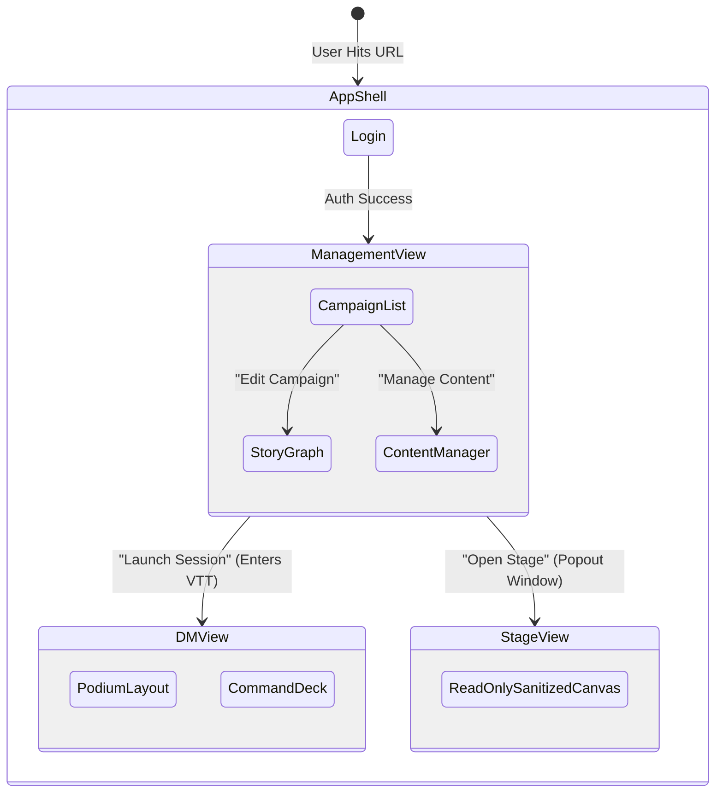
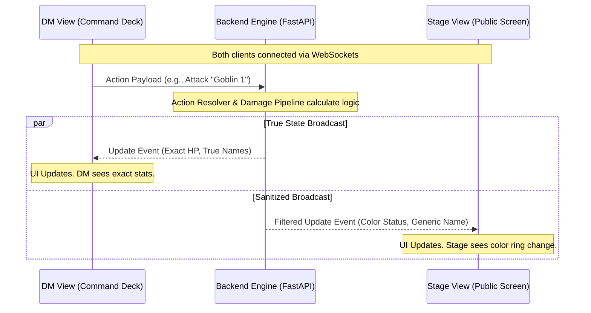

# Frontend Architecture: High-Level Interaction & Communication

## 1. Introduction

The CMV2 Frontend is composed of several distinct "Views" (Microfrontends or complex route components) that serve different purposes in the lifecycle of a D&D session. Because these views do very different things—ranging from out-of-session prep to high-intensity live combat management to public screen sharing—understanding how data flows between them and how they interact with the backend is critical.

This document outlines the overarching communication strategies and transition flows between the primary frontend components.

## 2. The View Lifecycle & Transitions

Users transition through the application via URL routing handled by the **App Shell** (`apps/host`). The App Shell acts as the persistent container, maintaining authentication state and rendering global overlays, while swapping out the core content area.

### Transition Flow



- **Out of Session:** The user lives in the **Management View**. The data flow here is traditional request/response (`fetch` or `react-query` to REST endpoints) to build narratives and manage data.
- **In Session:** The user clicks "Launch Session". The router loads the **DM View**. Upon mounting, the DM View initializes the **WebSocket Bridge**.
- **Public Screen:** The user opens a popout window to the **Stage View**. This instance _also_ initializes its own WebSocket connection, but with read-only/stage credentials.

## 3. Communication Architecture: The Triad

Once a live session starts, the application moves away from REST and relies almost entirely on the WebSocket state engine. The architecture consists of a triad: The DM View, the Backend Engine, and the Stage View.

### The "Authoritative Server" Model

The frontend **never** trusts its local state as the absolute truth. It uses an Authoritative Server model.

1. **Intent:** The DM clicks "Damage Goblin for 5 HP" in the `CommandDeck`.
2. **Dispatch:** The UI calls `bridge.actions.damage(targetId, 5)`. The frontend does _not_ immediately subtract 5 HP from its local store.
3. **Resolve:** The Backend Engine receives the action, runs the `DamagePipeline` (checking for resistances, immunities, temporal HP), and calculates the actual new HP.
4. **Broadcast:** The Backend broadcasts a `TOKEN_UPDATED` or `HP_CHANGED` event containing the true new data.
5. **Sync:** Both the DM View and the Stage View receive this broadcast, update their local `Zustand` stores, and React re-renders the UI.

### Data Flow Diagram



## 4. Inter-Component Communication (Within a View)

Within the dense **DM View**, the application must synchronize dozens of components (Left Toolbox, Map Canvas, Right Combat Panel, Bottom Command Deck) without causing disastrous re-renders.

### The `GameStateStore` vs `SelectionStore`

We split the local state into two distinct `Zustand` boundaries:

1. **Global Game State (`GameStateStore`)**:
   - Tracks the massive `EncounterState` (all tokens, HP, conditions, map fog).
   - Only mutates when receiving WebSocket payloads from the Bridge.
   - Components subscribe _only_ to the specific slices of data they need (e.g., the `CombatTracker` only subscribes to the `initiative_order` array) to prevent full-app re-renders on every token move.

2. **Ephemeral UI State (`SelectionStore`)**:
   - Tracks what the user is currently doing (e.g., "I have the Goblin token selected", "I am using the wall drawing tool").
   - This state is strictly local to the browser and never sent to the backend.
   - The `CommandDeck` listens intensely to this store. When `SelectionStore.activeTokenId` changes from `null` to `"goblin-123"`, the Command Deck immediately morphs from Global Controls to Monster Actions.

### Inter-Component Flow Example

```mermaid
graph TD
    Map[DMCartographer Canvas] --> |User Clicks Token| Selection[SelectionStore: setTarget('goblin1')]
    Selection --> CommandDeck[Command Deck UI]
    CommandDeck --> |Morphs UI| Buttons[Show Goblin Attacks]

    Buttons --> |User Clicks Attack| Bridge[Bridge SDK]
    Bridge --> |WebSocket| Backend[Server]

    Backend --> |WebSocket State Patch| GameStore[GameStateStore]
    GameStore --> Map[Map Re-renders Token Animation]
    GameStore --> CombatPanel[Combat Tracker Updates Vitals]
```

## 5. Summary

- **App Shell:** Routes between high-level App states (Prep vs Play).
- **Management View:** Traditional CRUD REST communication.
- **DM & Stage Views:** Entirely WebSocket driven, relying on the **Authoritative Server** paradigm.
- **Internal Synchronicity:** Local browser UI state (what is selected) is strictly separated from incoming Game State (who is alive) via segregated Zustand stores to maximize rendering performance.
