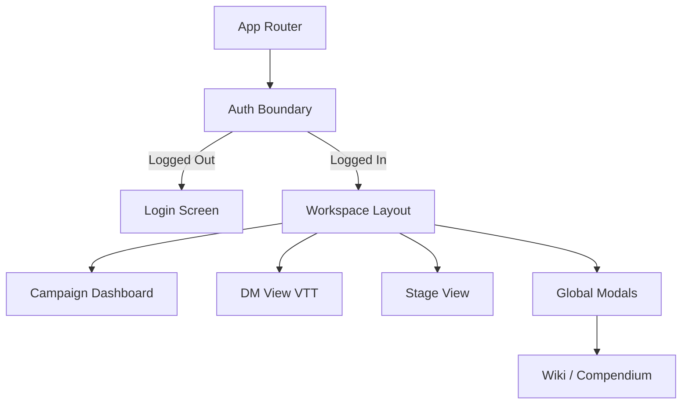

# Frontend App Shell & Routing

## 1. Overview

The `apps/host` serves as the primary entry point and orchestrator for all Microfrontends (MFEs) in the CMV2 system. It handles user authentication, session management, global overlay modals (like the Wiki), and routing to the specific environment views (Management, Stage, or DM).

## 2. Core Concepts / Layout

The App Shell is designed to be a lightweight container that lazy-loads the heavy VTT applications on demand. This ensures initial load times are fast while allowing the DM and Management packages to exist independently.

### Routing Architecture

- `/`: The default landing page, redirecting unauthenticated users to login, or showing the Campaign List (from Management View) to authenticated users.
- `/campaigns/:id/creator`: Mounts the `@rpg/management-view` MFE for outlining and editing a specific campaign.
- `/campaigns/:id/stage`: Mounts the Stage View component from `@rpg/dm-view` for public screen sharing.
- `/campaigns/:id/dm`: Mounts the heavy DM View component from `@rpg/dm-view` for active gameplay.

### Global Overlays

The Shell manages z-index heavy components that must persist across route changes or sit above all MFEs:

- **WikiModal**: A floating `Dialog` components that allow a DM to search Spells/Monsters without leaving a loaded combat view.
- **Settings**: Global configurations (Theme, Audio Output, Hotkeys).

## 3. Key Components / State

- **`AppRouter`**: A React Router implementation defining the lazy-loaded boundaries.
- **`AuthContext` / `useAuthStore`**: Stores JWT tokens and current user preferences. Intercepts API requests to attach bearer tokens.
- **`WorkspaceLayout`**: The persistent shell frame (Top Navbar) that remains visible in non-VTT modes.

## 4. Example Data Flow

## 5. Dependencies

- React Router DOM
- `@civic/design-system` (for AppNavbar and Overlays)
- `@rpg/management-view` (lazy loaded)
- `@rpg/dm-view` (lazy loaded)
