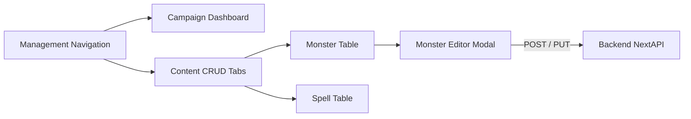

# Management View: Dashboard & Content CRUD

## 1. Overview

The Management View is a dedicated frontend package (`packages/management-view`) focused on the out-of-session prep work for a Game Master. It allows creation of new campaigns, launching existing ones, and managing custom homebrew content (Monsters, Spells, Items) using traditional CRUD interfaces.

## 2. Core Concepts / Layout

Unlike the dense, highly interactive DM VTT view, the Dashboard favors clean, accessible lists and data tables. It utilizes the `@civic/design-system` extensively to provide a standard web application feel.

### Campaign Dashboard

A grid or list layout displaying all campaigns the user owns or is invited to. Each card shows:

- Campaign Title & Banner Image.
- Quick action buttons: "Launch Session" (Routes to DM View), "Edit Story" (Routes to StoryGraph), "Stage Mode" (Routes to Stage View).

### Content Manager

A tabbed interface for managing definitions that reside in the Database.

- **Bestiary Tab**: A high-density data table of Monster Definitions. Allows importing JSON (from 5eTools/Open5e format) or creating monsters from scratch via a large modal form.
- **Items & Spells Tab**: Similar CRUD interfaces for standard SRD or homebrew additions.

## 3. Key Components / State

- **`CampaignGrid`**: Renders `CampaignCard` components queried from the backend `GET /api/campaigns`.
- **`DataTable`**: A generic reusable component from the design system handling pagination, sorting, and filtering of large datasets (like 300+ spells).
- **`ContentModal`**: A dynamic form component built with `react-hook-form` and `zod` schema validation that mirrors the Backend Pydantic models (e.g., `MonsterDefinition`).

## 4. Example Layout

The Content Manager heavily relies on data handling rather than complex interactions.

## 5. Dependencies

- `react-hook-form` & `@hookform/resolvers/zod` (Form validation)
- `@civic/design-system` (Tables, Modals, Forms)
- `react-query` or similar for caching dataset requests.
