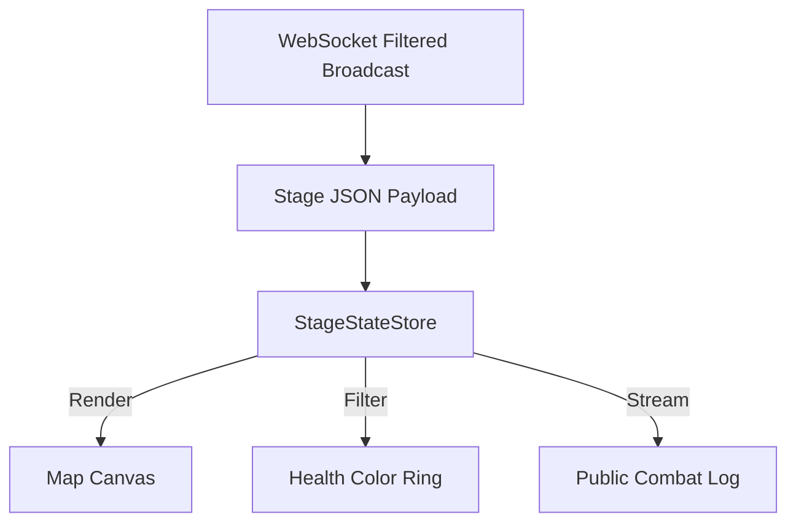

# Stage View: The Public VTT

## 1. Overview

The Stage View is a highly sanitized, read-only interface meant to be popped out to a secondary display or screen-shared via Discord/OBS. It provides the "Player Vision" of the VTT, displaying the combat map, obscured health metrics, and a filtered chat log without exposing any DM secrets.

## 2. Core Concepts / Layout

The primary directive of the Stage View is minimalism. It has no command bars, no toolbars, and no settings dialogs. It maximizes screen real estate for the visual representation of the game.

### Map & Fog of War

- **`StageCartographer`**: Renders the background map and all tokens.
- **Opaque Fog**: In this view, the "Fog of War" mask delivered from the backend (`SceneState`) is fully opaque. Areas undefined by the DM as revealed are rendered pitch black.
- **Sync or Static**: The view can either independently pan/zoom, or sync its `cameraPosition` directly to the `cameraPosition` broadcasted by the DM View (allowing the DM to "drive" the player view).

### Sanitization & UI

- **Health Rings**: The exact `hp` values are never sent to the Stage View. Tokens are given a generic "health status" (e.g., `Healthy`, `Bloodied`) which maps to a colored ring around the token icon (Green/Yellow/Red).
- **Name Obfuscation**: Monsters will display default archetype names ("Goblin") or numeric identifiers ("Kobold 1") unless explicit `revealTrueName` flags are true on the backend state.
- **Filtered Log**: An overlay showing combat rolls. Hidden DM rolls or system errors are quietly omitted via payload filtering before the WebSocket even broadcasts the state.

## 3. Key Components / State

- **`StageStateStore`**: A lean Zustand store initialized exclusively via incoming `WsEnvelope` messages. It cannot dispatch actions to mutate the state.
- **`TokenRenderer`**: Uses HTML5 Canvas or WebGL (PixiJS/Fabric) to efficiently raw draw the sanitized token state.
- **`StageOverlay`**: A minimal UI layer floating over the canvas, showing simple turn order (Initiative Tracker without numbers).

## 4. Example Data Flow

## 5. Dependencies

- `@rpg/bridge` (WebSocket listener)
- State synchronization hooks filtering out `hidden` tags.
