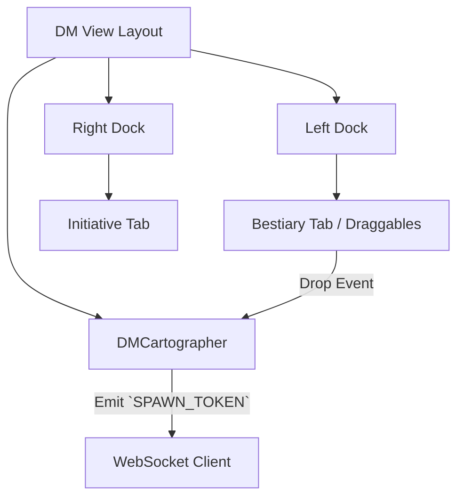

# DM View: The Podium & Layout

## 1. Overview

The DM View is the dense, interface-heavy "Conductor's Podium" used by the Game Master during a live session. It provides omniscient control over the combat state, enemies, the map, and audio, allowing rapid context-switching.

## 2. Core Concepts / Layout

Built around a flexible docking system (`flexlayout-react` or similar bespoke grid), the layout hovers over the active map background.

### The 3-Column Docking Grid

- **Map Focus**: The background is the `DMCartographer`. It renders 100% of the screen. All other UI elements are translucent, floating panels.
- **Left Panel (Toolbox)**:
  - _Bestiary_: A quick-search list of `MonsterDefinition`s to drag-and-drop onto the map to spawn instances.
  - _Players_: A persistent sidebar showing player HP, Passive Perception, and AC for quick DM reference without asking them.
- **Right Panel (Combat)**:
  - _Initiative Tracker_: A detailed combat order list displaying exact HP, condition icons, and concentration status. Contains controls for "Next Turn" and manual overrides.
  - _Master Chat / Log_: An unredacted chat history showing every single roll, including hidden DM rolls and system whispers.

### DM Fog and Layers

The `DMCartographer` operates with higher privileges than the Stage View.

- _Fog of War_ is rendered as translucent grey (rather than opaque black), allowing the DM to see monsters hidden in the fog.
- _Drawing Tools_: Polygons, walls, and lighting sources can be placed directly onto the active scene layer.

## 3. Key Components / State

- **`AppLayoutNode`**: The container logic managing which tabs are open and visible in the left/right docks.
- **`DMPanelTabs`**: Specific React components mounted into the layout frames (e.g., `BestiaryTab`, `TrackerTab`).
- **`LayoutStore` (Zustand)**: Persists the user's preferred layout dimensions (e.g., 20% left panel, 60% transparent center, 20% right panel) to `localStorage`.

## 4. Example State Architecture

## 5. Dependencies

- Flex layout library.
- `@rpg/bridge`
- `react-dnd` (or HTML5 Drag and Drop) for dropping elements onto the canvas.
