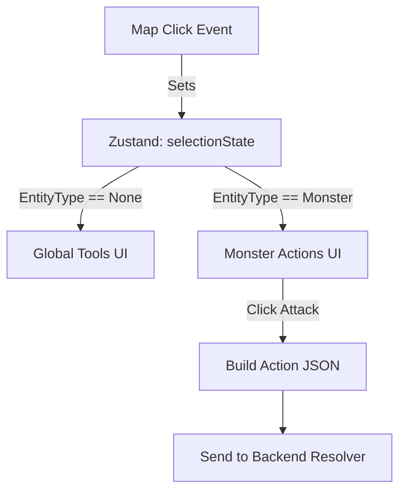

# DM View: The Command Deck & Selection Engine

## 1. Overview

The most complex interactive element of the DM View is the **Command Deck**—a context-aware action bar permanently docked to the bottom center of the screen. It morphs its available interfaces and buttons based on what the DM has currently selected on the map.

## 2. Core Concepts / Layout

The Command Deck solves the problem of "too many buttons" by displaying only relevant tools. It reads from the global `SelectionState`.

### Context Switching

- **Global Scene Mode (Nothing Selected)**:
  - Quick-toggles for Fog of War (Reveal brush, Hide brush).
  - Audio/Music play and pause.
  - Advance Time buttons (Short Rest, Long Rest).
- **Monster Mode (Monster Selected)**:
  - Displays the monster's portrait, exact HP (with +/- fast edit inputs), and AC.
  - Generates clickable buttons for the monster's Attacks (e.g., "Bite", "Shortsword").
  - Provides quick action buttons (Hide, Dash, Disengage).
  - A button to pop open a modal showing the full 5e Stat Block.
- **Drawing Mode (Drawing Tool Selected)**:
  - Displays color pickers, line width sliders, and eraser toggles.

### Engine Integration

Clicking an Attack button on the Command Deck formats a payload matching the backend's Action Resolver (`ActionPayload`) and dispatches it over the WebSocket, instructing the backend `engine` to resolve the attack and deduct the action cost from the monster's `TurnBudget`.

## 3. Key Components / State

- **`useSelectionStore`**: A Zustand store tracking exactly one `activeEntityId` and `activeEntityType`.
- **`CommandDeckContainer`**: A React shell that conditionally renders sub-decks (`GlobalDeck`, `MonsterDeck`, `DrawingDeck`).
- **`ActionDispatcher`**: A utility hook mapped to the Deck buttons that formulates complex JSON requests (e.g., Target ID + Attack ID + Advantage Flag) to send via the bridge.

## 4. Selection Architecture Flow

## 5. Dependencies

- `Zustand` (Selection state is rapid-fire and complex; Context API would cause too many re-renders).
- Strict adherence to the `schemas.ActionPayload` Pydantic models to ensure the UI sends valid attack requests.
